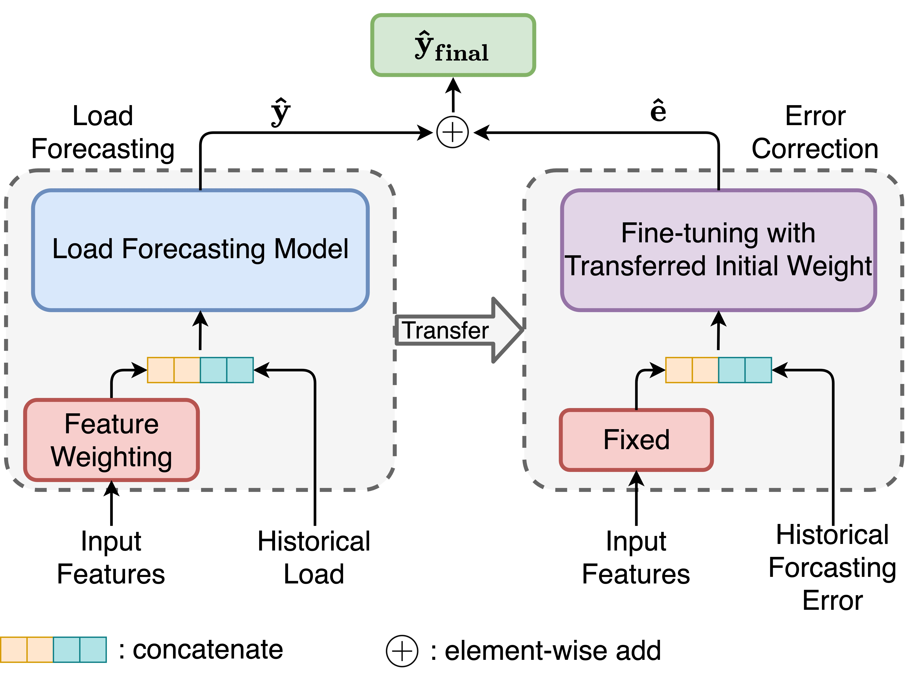

# A Unifying Framework of Attention-based Neural Load Forecasting
Contact me with jxiong20@ucsc.edu.

## Introduction
The official code for paper
[[A Unifying Framework of Attention-based Neural Load Forecasting](https://ieeexplore.ieee.org/document/10122506)]

<p align="center">
  
</p>

We propose a unifying deep learning framework for short-term load forecasting. 
Our novel approach includes time-varying feature weighting, hierarchical temporal attention, and feature-reinforced error correction. 
The proposed modular design features good generalization capability, which achieves superior performance over the SOTA.


## Attention-based load forecasting Framework with LSTM implementation (PM-LSTM)
Run load forecasting model training, update model training and test result for ISO-NE dataset:
```
python ANLFF.py --data ISONE --final_run --updateCkpName checkpoint_update_ISO --logname ANLFF_ISO --subName ANLFF_ISO
```
Run load forecasting model training, update model training and test result for NAU dataset:
```
python ANLFF.py --data Utility --final_run --updateCkpName checkpoint_update_NAU --logname ANLFF_NAU --subName ANLFF_NAU
```

## License
**The project is only free for academic research purposes, but needs authorization for commerce. For commerce permission, please contact jxiong20@ucsc.edu.**

## Citation
If you use our code/model, please cite our [[paper](https://ieeexplore.ieee.org/document/10122506)].

```bibtex
@ARTICLE{10122506,
  author={Xiong, Jing and Zhang, Yu},
  journal={IEEE Access}, 
  title={A Unifying Framework of Attention-Based Neural Load Forecasting}, 
  year={2023},
  volume={11},
  number={},
  pages={51606-51616},
  doi={10.1109/ACCESS.2023.3275095}}
}
```

